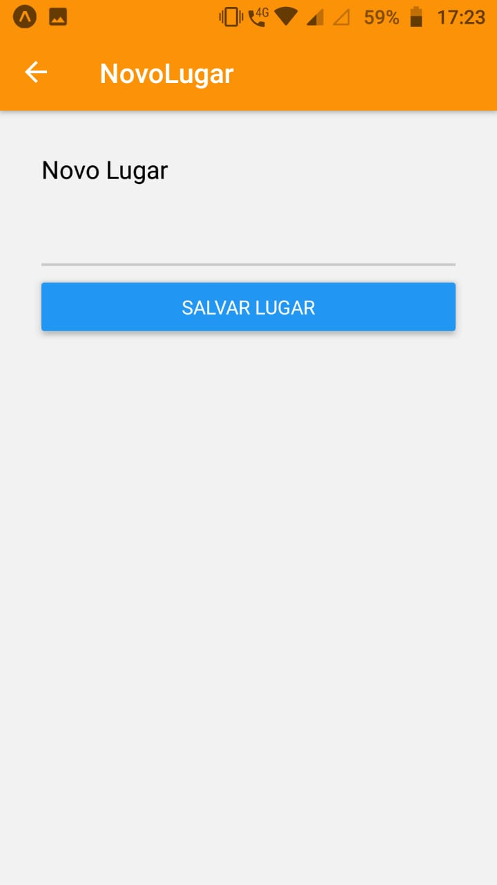
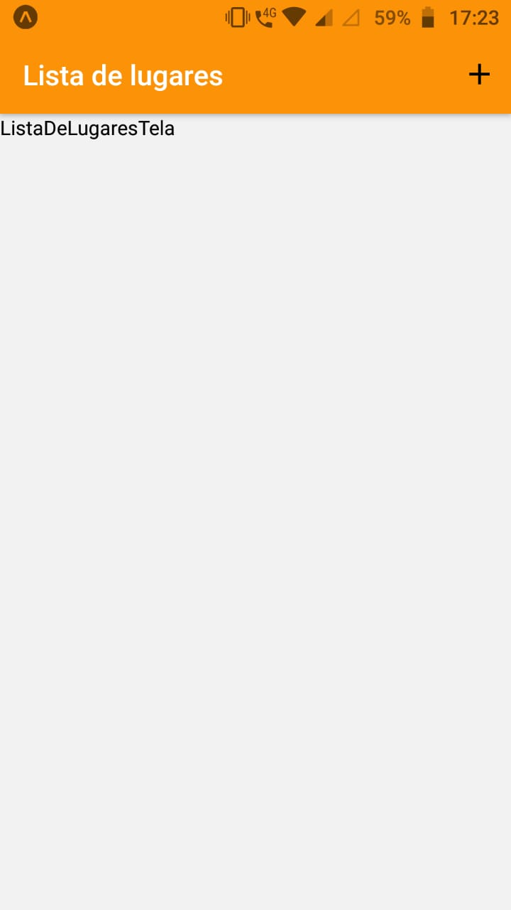

# Recursos-nativos

<p align="center">
<p><b>Mobile</b><p/>
  
  
</p>

## 📦 Como baixar o projeto
  * Pré-requisitos
    * É preciso ter um gerenciador de pacotes seja o NPM ou Yarn.
    * Expo instalado
    * Uma IDE como vsCode

```bash

  #Clonar o repositório
  $ git clone https://github.com/JonathanKBP/Recursos-nativos.git
  
  # Instalar as dependencias
  $ npm install
  # ou
  $ yarn install

  # Inciar o projeto
  $ expo start  

```

Desenvolvido por 💻  Jonathan Kevin
